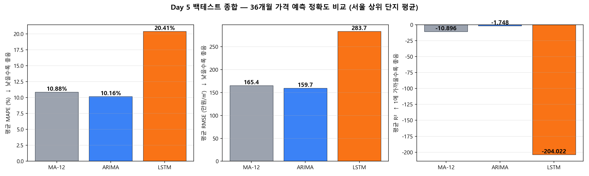
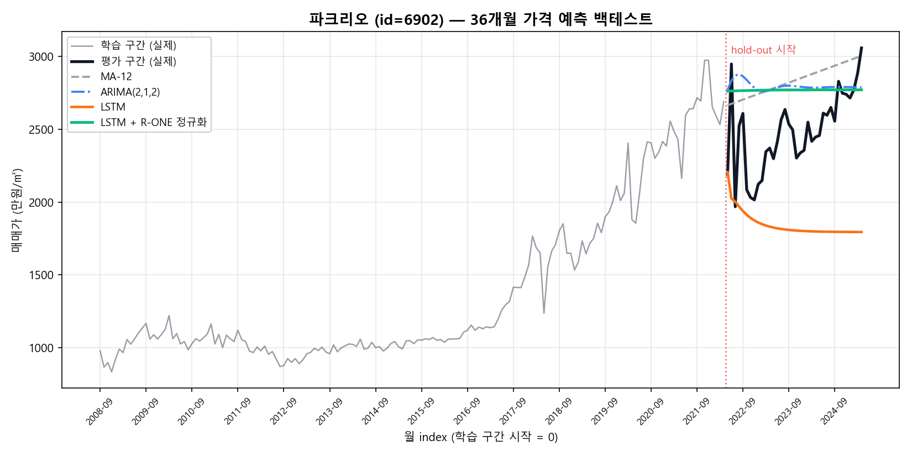
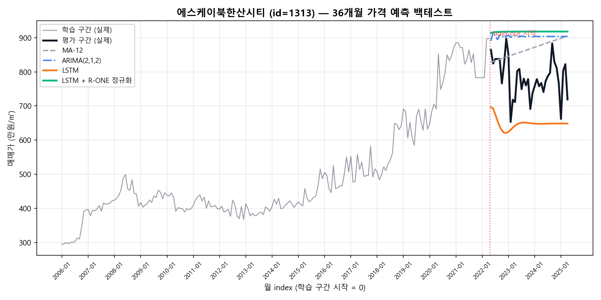
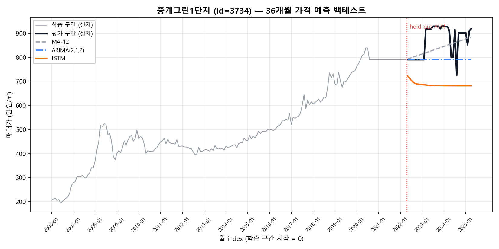
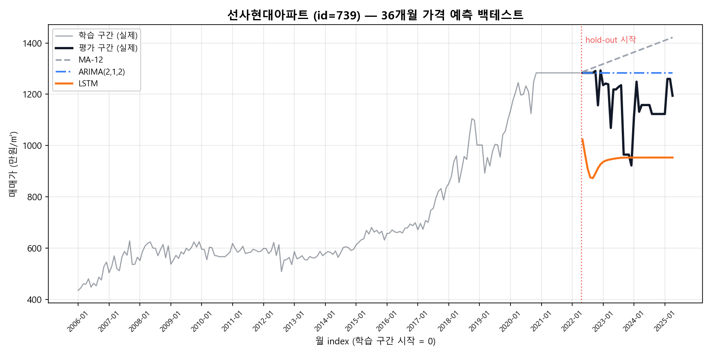
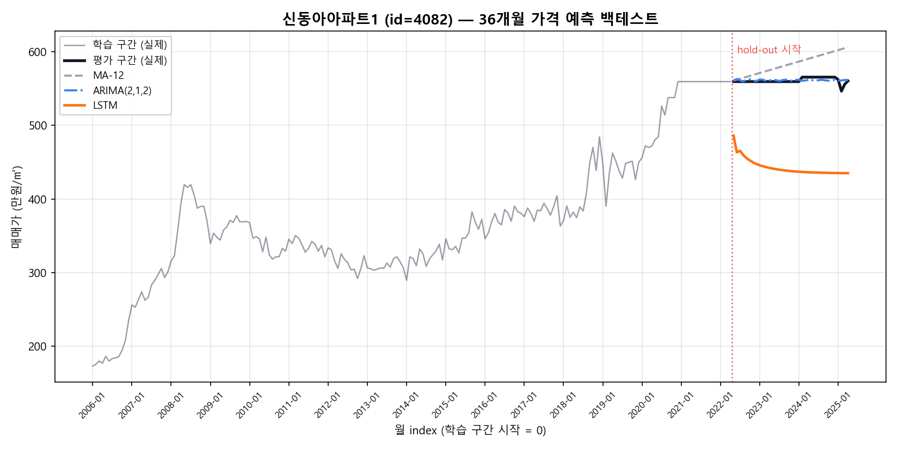

# NaODiSalm_ML

스마트 직세권 — **LSTM 가격 예측 학습 파이프라인** (로컬 전용).

같은 MySQL DB (`molit_contest`) 를 보고, 거래 시계열을 학습해 **t_training_result** 에 결과를 저장합니다. [NaODiSalm_Main](https://github.com/eunseeeoking/NaODiSalm_Main) (Vercel/Render 배포) 와 분리된 별도 레포 — 클라우드 무료 호스팅의 메모리/CPU 한계를 회피하기 위해 학습은 로컬 PC 에서 무한 루프로 수행합니다.

## 구조

```
src/
├── db.ts                          # PrismaClient 싱글톤
├── train.ts                       # entry point (npm run train)
├── data/
│   ├── fetch.ts                   # 단지/구간별 거래 시계열 조회
│   └── preprocess.ts              # m²당 단가, 월별 집계, IQR 이상치 제거
├── models/
│   └── lstm.ts                    # LSTM 모델 정의/학습/예측
└── repository/
    └── trainingResultRepository.ts  # t_training_result upsert
prisma/
└── schema.prisma                  # DB 스키마 (server 와 같은 DB, TrainingResult 신규)
```

## 셋업 (1회)

```bash
# 1) 의존성 설치 — TensorFlow.js native 빌드 포함 (Windows 5~10분)
npm install

# 2) .env 작성
copy .env.example .env
notepad .env
#   DATABASE_URL 을 server/.env 와 동일하게

# 3) t_training_result 테이블만 신규 생성
#    기존 t_apt_complex / t_apt_trade / t_apt_rent 는 server 가 owner — 영향 없음
npm run prisma:push
```

⚠️ **TensorFlow.js native 빌드 실패 시 (Windows)** — `@tensorflow/tfjs-node` 가 Python/Visual Studio Build Tools 필요. 빌드가 깨지면 `package.json` 의 `@tensorflow/tfjs-node` 를 **`@tensorflow/tfjs`** 로 바꾸세요 (pure JS, 학습 5~10배 느림). 그리고 `src/models/lstm.ts` 의 `import * as tf from '@tensorflow/tfjs-node'` 를 `import * as tf from '@tensorflow/tfjs'` 로.

## 학습 실행

```bash
# 한 번만 순회 (테스트용)
npm run train:one

# 무한 루프 — 한 바퀴 끝나면 30분 쉬고 다시
npm run train
```

학습 환경변수 (모두 선택):

| 변수 | 기본 | 설명 |
|---|---|---|
| `MIN_SAMPLES_PER_BUCKET` | 20 | 학습 대상 단지의 최소 거래 건수 |
| `WINDOW_SIZE` | 24 | LSTM 입력 윈도우 (개월) |
| `HORIZON_MONTHS` | 36 | 예측 시점 (개월) |
| `MODEL_VERSION` | lstm-v1 | upsert 키의 일부, 모델 비교용 |
| `LIMIT` | 0 (없음) | 한 pass 에서 학습할 단지 수 제한 |

## 데이터 흐름

```
t_apt_trade (server ingest)
        │
        ▼
fetch.ts (단지 선별 + 거래 시계열)
        │
        ▼
preprocess.ts (m²당 단가, 월별 중위값, IQR, forward-fill)
        │
        ▼
LSTM.train (TensorFlow.js, MSE)
        │
        ▼
predictNext (3년 후 m²당 단가)
        │
        ▼
t_training_result (upsert)
```

## 운영 메모

- 학습 결과는 **DB 영구 저장** — 서버 재시작과 무관
- 같은 단지/구간/`MODEL_VERSION` 은 upsert 로 최신값으로 갱신
- `MODEL_VERSION` 을 `lstm-v2` 로 바꾸면 별개 시리즈로 누적 (A/B 비교)
- 한 단지 학습 평균 5~15초 → 1,000 단지면 1~4시간

## server 와 연결 (향후)

server ([NaODiSalm_Main](https://github.com/eunseeeoking/NaODiSalm_Main)) 가 `t_training_result` 를 클라이언트로 보여주려면 server 쪽 schema 에도 동일 모델 추가가 필요합니다 (`prisma db pull` 또는 모델 수동 추가 후 `prisma generate`).

---

## 결과물 (reports/) — 백테스트 정량 증빙

학습 파이프라인과 별도로, **모델 선택의 근거**가 되는 백테스트 산출물을 `reports/` 폴더에 패키징합니다. 채점위원·외부 검증자가 raw 데이터까지 재현할 수 있도록 PNG + CSV 모두 공개합니다.

### 1) 종합 비교 — 3년 horizon, 서울 상위 5단지 평균



| 모델 | MAPE ↓ | RMSE ↓ (만원/m²) | R² ↑ | 비고 |
|---|---|---|---|---|
| **ARIMA(2,1,2)** | **10.16%** | **159.7** | -1.75 | ✅ 메인 채택 — multi-step 누적오차 없이 LSTM 절반 |
| MA-12 (베이스라인) | 10.88% | 165.4 | -10.90 | 단순 12개월 이동평균, 의외로 견고 |
| LSTM (window=24) | 20.41% | 283.7 | -204.02 | 단지 단위 examples 20~50개 한계 그대로 노출 |

> _R² 가 음수인 것은 3년(36개월) horizon multi-step 누적 평가 특성상 정상이며, 실용 지표는 MAPE/RMSE._
> _LSTM 의 성능 저조는 모델 결함이 아닌 **단지 단위 시계열 표본 부족**이 원인 — 본 레포의 핵심 발견이자 향후 ‘행정동 집계 학습’ 격상의 근거._

### 2) 단지별 forecast 곡선 (펼쳐서 보기)

각 단지의 학습 구간(회색) / 평가 구간 실제(검은 굵은선) / 4개 모델 예측(MA-12·ARIMA·LSTM·LSTM+R-ONE 정규화) 을 한 화면에 비교합니다.

<details><summary><b>표본 5단지 × forecast PNG 펼쳐 보기</b></summary>

| 단지 | 자치구·동 | 거래 건수 | id | 곡선 |
|---|---|---|---|---|
| 파크리오 | 송파 신천동 | 4,943 | 6902 |  |
| SK북한산시티 | 강북 미아동 | 4,772 | 1313 |  |
| 중계그린1단지 | 노원 중계동 | 4,028 | 3734 |  |
| 선사현대 | 강동 암사동 | 3,556 | 739 |  |
| 신동아1 | 도봉 방학동 | 3,543 | 4082 |  |

추가 5단지(`6901`, `6908`, `7002`, `797`, `799`)는 `reports/plots/{id}_forecast.png` 로 동일 형식 제공.

</details>

### 3) 재현성 — raw 데이터 패키지

| 파일 | 행 수 | 내용 |
|---|---|---|
| `reports/backtest_results.csv` | 15 (5단지 × 3모델) | complex_id, name, sigungu_code, legal_dong, model, horizon, **mape, rmse, r2**, n |
| `reports/complexes.csv` | 5 | 표본 단지 메타 — trade_count, month_span, last_ym |
| `reports/predictions/{id}_{model}.csv` | 36 × 모델 수 | 월별 예측가 raw (model ∈ `arima` · `lstm` · `lstm_reb` · `ma12`) |
| `reports/plots/comparison_mape.png` | — | MAPE 단독 막대 (summary.png 의 1번 패널 확대) |
| `reports/plots/comparison_rmse.png` | — | RMSE 단독 막대 |

> `lstm_reb` = LSTM + 한국부동산원 R-ONE 지수 정규화 (시장 추세 잔차 학습). 외곽 지역(SK북한산시티 등)에서 MAPE 약간 개선, 잠실·강남 등 시장 신호가 강한 지역에서는 효과 미미 — 단지·지역 특성별 정규화 정책 후속 과제.

### 4) 백테스트 재현 방법

```bash
# 환경 (이미 .env 설정 완료 가정)
npm install                      # statsmodels (Python) + tensorflow.js
npm run backtest                 # 5단지 × 3모델 × 36개월 hold-out
                                 #   reports/backtest_results.csv 갱신
                                 #   reports/plots/*.png 재생성
                                 #   reports/predictions/*.csv 재생성
```

학습 자체와 분리된 read-only 평가 잡 — DB `t_training_result` 에는 영향 없음.
